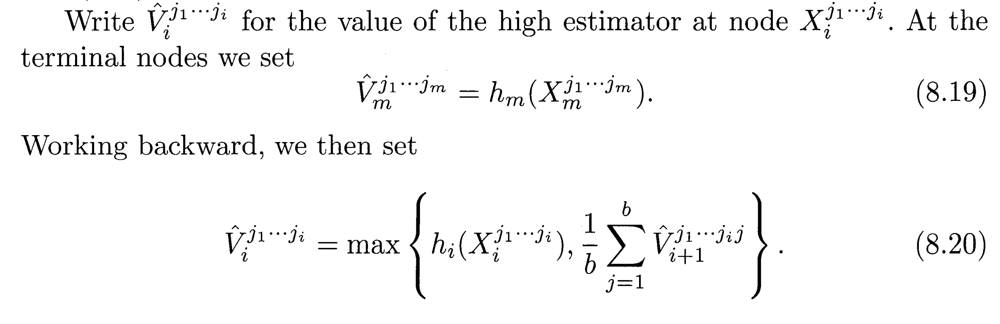
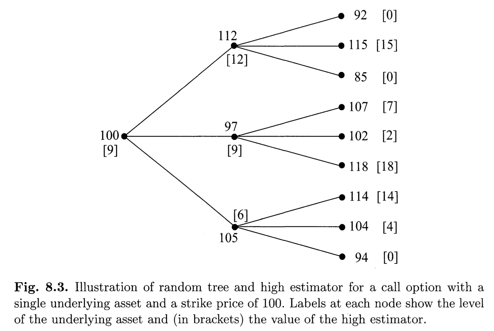
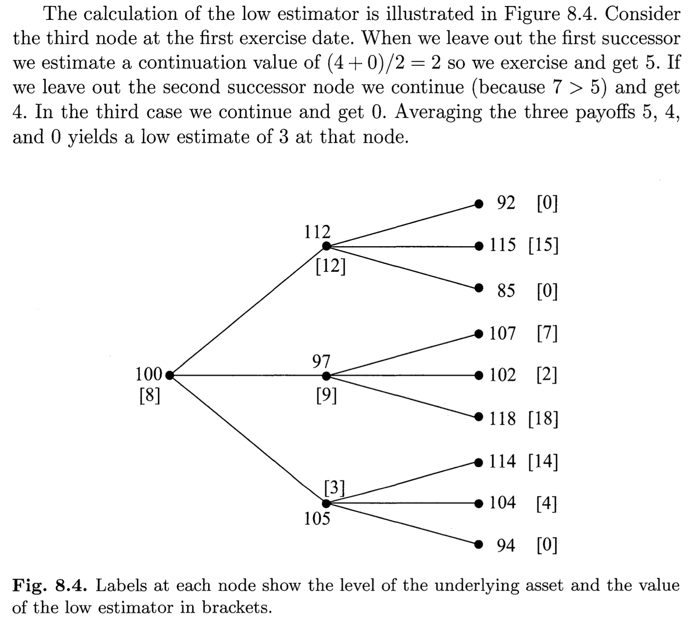

# Opcje amerykańskie

Amerykańska opcja sprzedaży może być zrealizowana przez jej nabywcę w dowolnym momencie $t \in [0,T]$, a jej wypłata wynosi wówczas $K - S_t$.

Niech S_0=50, sigma=0.3, T=0.25, r=0.05, K=50.

Cena z kalkulatora dla powyższych parametrów ("Days to Expiration = 91", <https://www.optionseducation.org/toolsoptionquotes/optionscalculator> ) wynosi 2.7176.

## Ćwiczenie 1.

Przypuśćmy, na potrzeby tego ćwiczenia, że $T = \infty$. Jest to (w obrocie wyłącznie na rynku OTC, tj. pozagiełdowym) opcja z nieskończonym terminem wykonania, tzw. "perpetual" lub "XPO".

Spróbujmy wycenić tę opcję przy założeniu, że optymalny moment $\tau$ wykonania opcji przez nabywcę, jest postaci:

$$
\tau_L = \inf\{ t\ge0 : S_t < L \}
$$

dla pewnego $L\in(0,K)$.

Funkcja wyznaczająca $\tau_L$ dla jednej, losowej trajektorii $S$:

```{r}
sample_tau_L = function(L, S_0=50, sigma=.3, r=.05, h=0.01, epsilon=0.01) {
  # Jak długo (w latach) trzeba czekać, by cena spadła poniżej wartości L:
  S = S_0
  t = 0
  # Aby algorytm działał w skończonym czasie,
  # przerywajmy poszukiwania, 
  # gdy exp(-rt) < epsilon,
  # czyli gdy -rt < log(epsilon):
  max_t = -log(epsilon) / r
  while (t < max_t) {
    t = t + h
    ## Your code goes here :)
    
    
    ##
    if (S < L)
      break
  }
  return ( t )
}
print(sample_tau_L(45))
```

Dla ustalonego $L$, wartość takiej strategii wykonania opcji przez nabywcę, wynosi $v_L(S_0)$, gdzie

$$
v_L(x) = (K-L) E[\exp(-r\tau_L)]
$$

```{r}
v_L = function(x, L, K=50, r=.05, n=100) {
  tau_L = replicate(n,  sample_tau_L(L, S_0 = x))  # (to jest wektor)
  df = exp(-r*tau_L) 
  ## Your code goes here :)
    
    
  ##
  return v
}
print(v_L(x = 50, L = 45))
```

Dla sprawdzenia, wartość analityczna $E[\exp(-r\tau_L)]$ dla $S_0=x \ge L$, to

$$
\left( \frac{x}{L} \right)^{-2r/\sigma^2}.
$$

```{r}
v_L_exact = function(x, L, K=50, r=.05, sigma=.3) {
  return ( (K-L) * (x/L)^(-2*r/(sigma^2))  )
}
print(v_L_exact(x = 50, L = 45))
```

Możemy teraz poszukać optymalnego momentu stopu $\tau_L$, dla różnych $L$, $0 < L < K$.

```{r}
S_0 = 50
K = 50
L = seq(from=10, to=K, by=10)
v = c() # pusty wektor
for (i in 1:length(L)) 
  v[i] = v_L(x = S_0, L = L[i]) 
plot(L, v)
```

Użyć funkcji 'optimize' do znalezienia przybliżonego maksimum v_L, w wybranym przedziale wartości parametru L. Przyjąć tol=0.5.

```{r}
S_0 = 50
f = function(y) {
  v_L(x = S_0, L = y, n=1000) 
}
## Your code goes here :)
  
  
##
print(L_opt)
```

Wzór analityczny na wartość niewygasającej amerykańskiej opcji sprzedaży, to:

$$
V(S_0,K) = 
\left(\frac{K}{p+1}\right)^{p+1}
\left(\frac{p}{S_0}\right)^{p},
\qquad\text{gdzie}\;
p = \frac{2r}{\sigma^2}.
$$

```{r}
V_XPO_exact = function(S_0, K=50, r=.05, sigma=.3) {
  p = 2*r/(sigma^2)
  pp = p+1
  return ( (K/pp)^pp *  (p/S_0)^p  )
}
print(V_XPO_exact(S_0 = 50))
```

## Ćwiczenie 2. Dynamic programming.

Znajdźmy wartość $V_0$ opcji w chwili $t_0=0$. Niech $h_i$ oznacza wypłatę z opcji w chwili $t_i$, zwaną też wewnętrzną wartością (*intrinsic value*) opcji. Ponieważ opcję amerykańską możemy w każdej chwili zrealizować (otrzymując $h_i$) lub czekać, jej wartość jest nie mniejsza od wartości wewnętrznej.

Wartość $V_i(X_i)$ opcji w chwili $t_i$ na rynku znajdującym się w stanie $X_i$ (w ogólności, $X_i$ jest wektorem zawierającym ceny instrumentów, losowe stopy procentowe $r$, poziom zmienności rynku $\sigma$, itd.), jest dana równaniem rekurencyjnym

$$
V_m(x) = h_m(x),\\
V_{i-1}(x) = \max\{ h_{i-1}(x), \; C_{i-1}(x) \},\quad 1\le i\le m,\\
\text{gdzie}\quad 
C_{i-1}(x) = E[D_{i-1,i}(X_i)V_i(X_i) \;|\; X_{i-1}=x],
$$

przy czym $D_{i-1,i}$ jest współczynnikiem dyskonta, tj. wartością, w momencie $t_{i-1}$, dolara otrzymanego w chwili $t_i$.

Ze względu na skończoną liczbę chwil $t_1,\ldots,t_m$, w których możliwa jest realizacja opcji, wartość $V_0$ tak wyznaczona jest obarczona błędem dyskretyzacji. Natomiast model ten jest dokładny dla opcji tzw. *bermudzkich*, które właśnie dopuszczają realizację opcji w kilku wybranych terminach przed jej wygaśnięciem; nazwa pochodzi stąd, że opcje bermudzkie są niejako pośrednie między europejskimi a amerykańskimi.

Wzory powyższe są stosowane dla różnych typów opcji amerykańskiej, której wypłata może zależeć np. od kilku instrumentów bazowych. Nadal jednak rozważamy najprostszy przypadek bez wzoru analitycznego, opcję sprzedaży jednego instrumentu, którego cena ewoluuje zgodnie z geometrycznym ruchem Browna, $dS/S=r dt + \sigma dW$. W szczególności zakładamy, że stopa procentowa $r$ jest stała, a zatem $D_{i-1,i}(X_i) = \exp(-r(t_i - t_{i-1}))$. Ponieważ decyzję o realizacji opcji podejmujemy wyłącznie na podstawie ceny $S$ instrumentu bazowego, to stan rynku $X_i$ zawiera tylko tę informację: $X_i=S(t_i)$, zaś każda z funkcji wypłaty $h_i$ ma wzór $h_i(x) = \max(0,K-x)$. Wobec tego, mamy:

$$
V_m(x) = \max(0,K-x),\quad x\ge0,\\
V_{i-1}(x) = \max\{ K-x, \; C_{i-1}(x) \},\quad x\ge0, \quad 1\le i\le m,\\
\text{gdzie}\quad 
C_{i-1}(x) = E[\exp(-r(t_i - t_{i-1})) V_i(S(t_i)) \;|\; S(t_{i-1})=x].
$$

Weźmy siatkę czasową z węzłami równoodległymi, $t_i = hi$, $h=T/m$. Wtedy

$$
C_{i-1}(x) = E[\exp(-rh) V_i(S(t_i)) \;|\; S(t_{i-1})=x]\\
= E[\exp(-rh) V_i(S_h) \;|\; S_0=x],
$$

skąd

$$
V_m(x) = \max(0,K-x),\quad x\ge0,\\
V_{i-1}(x) = \max\{ K-x, \; E[\exp(-rh) V_i(S_h) \;|\; S_0=x] \},\quad x\ge0, \quad 1\le i\le m.
$$

Pamiętamy, że chcemy obliczyć $V_0(S_0)$. Dla $i=m$, warunkowa wartość oczekiwana $E[\exp(-rh) V_i(S_h) \;|\; S_0=x]$ jest wartością opcji europejskiej (put) z terminem wykonania $h$, daną wzorem jawnym:

$$
C_{m-1}(x) = E[\exp(-rh) V_m(S_h) \;|\; S_0=x]
\\
=E[\exp(-rh) \max(0,K-S_h)\;|\; S_0=x]
\\
=
\Phi(d_+)Ke^{-rh}-\Phi(d_-)x,\\
\text{gdzie}\quad
d_\pm
=
\frac{\log(K/x)-rh}{\sigma\sqrt{h}}\pm\frac{\sigma\sqrt{h}}{2},
\quad
\Phi - \text{dystrybuanta}\; N(0,1).
$$

Odpowiednia funkcja w R:

```{r}
C_m_1_exact = function(x, K=50, sigma=.3, r=.05, h=0.01) {
  s = sigma * sqrt(h)
  dplus  = (log(K/x)-r*h) / s + s/2
  dminus = dplus - s
  df= exp(-r*h)
  return ( pnorm(dplus)*K*df - pnorm(dminus)*x  )
}
```

W kolejnych iteracjach, przy poszukiwaniu kształtu funkcji $V_i$, $i < m$, już nie mamy wzorów jawnych.

## Ćwiczenie 2.

Wyznaczyć aproksymację funkcji $V_{m-1}$ na przedziale $[0,100]$, dla h=0.01 oraz dla wartości sigma, r, K, jak wyżej. Porównać wynik z postacią analityczną na wykresie.

```{r}
sample_S_h = function(x, h=.01, sigma=.3, r=.05) {
  Z = rnorm(1)
  S_h = x * exp((r-sigma^2/2)*h + sigma*sqrt(h)*Z)
  return( S_h )
}
V_m = function(x, K=50) {
  return ( max(0, K - x) )
}
C_m_1 = function(x, h=.01, r=.05) {
  ## Your code goes here :)
  
  
  ##
}
x = seq(1,100,1)
C_m_1_approx = c()
C_m_1_real = c()
for (i in 1:length(x)) {
  C_m_1_approx[i] = C_m_1(x[i])
  C_m_1_real[i] = C_m_1_exact(x[i])
}
plot(x,C_m_1_approx,type="l",col="red")
lines(x,C_m_1_real,type="l",col="green")
```

# Ćwiczenie 3. Drzewa losowe

Będziemy rozważać nieco inną wersję równań rekurencyjnych dla $V_i$. Zakładamy teraz, że $h_i$, $C_i$ oraz $V_i$ są wartościami zdyskontowanymi, tj. zawierającymi czynnik $\exp(-rt_i)$:

$$
V_m(x) = h_m(x),\\
V_{i-1}(x) = \max\{ h_{i-1}(x), \; C_{i-1}(x) \},\quad 1\le i\le m,\\
\text{gdzie}\quad 
C_{i-1}(x) = E[V_i(X_i) \;|\; X_{i-1}=x].
$$

Ustalmy $b\ge 2$. Każdy węzeł drzewa odpowiada pewnemu stanowi w łańcuchu Markowa, co przekłada się na następującą metodę generowania kolejnych węzłów. Każdy węzeł (stan rynku $X_{i-1}=x$ w momencie $t_{i-1}$), ma $b$ potomków (wartości $X_i$), generowanych niezależnie z jednakowym rozkładem warunkowym:

$$
P(X_i=y | X_{i-1}=x).
$$

Wyznaczymy dwa estymatory, "górny" $\hat V$ i "dolny" $\hat v$:

$$
E\hat V_0 \ge V_0(S_0) \ge E\hat v_0.
$$

Estymator górny wyznaczymy wg przepisu (Glasserman, 8.3.1):



Pomocny będzie przykład na poniższym rysunku, gdzie przyjęto dla uproszczenia $h_i(x) = (x - 100)_+$:



Gdy mamy już metodę otrzymywania $\hat V_0(S_0)$, replikujemy tę funkcję $n$ razy, otrzymując pewien wektor próbek $\hat V_0(S_0)$. Pozwala to następnie oszacować przedział ufności dla $E\hat V_0(S_0)$.

Estymator dolny wyznaczymy wg przepisu (Glasserman, 8.3.1):




Gdy mamy już metodę otrzymywania $\hat v_0(S_0)$, replikujemy tę funkcję $n$ razy, otrzymując pewien wektor próbek $\hat v_0(S_0)$. Pozwala to następnie oszacować przedział ufności dla $E\hat v_0(S_0)$.

Dalej, otrzymujemy zachowawcze oszacowanie przedziału ufności dla $V_0(S_0)$:


Możemy polepszyć czas działania tej metody, generując 1 zamiast b potomków w tych stanach, gdzie nie opłaca się realizować opcji, i wyliczając górny bądź dolny estymator jako zdyskontowaną wartość z węzła potomnego.
