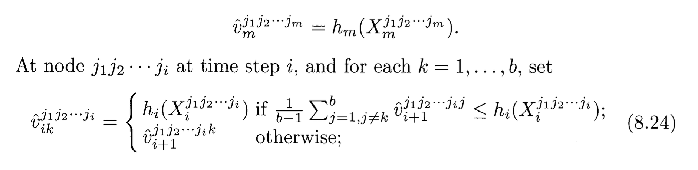
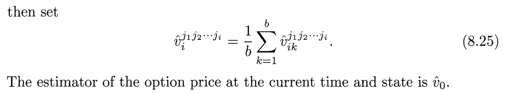
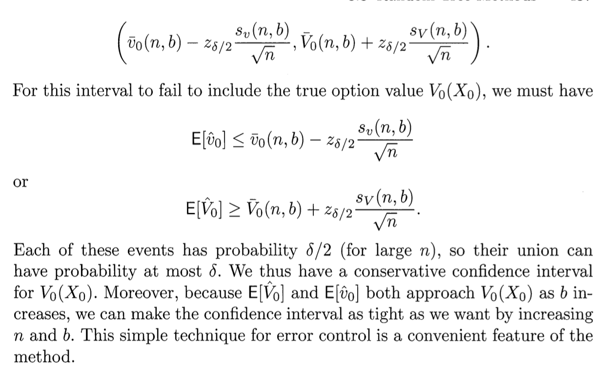

#TODO: ze screenshot'ów z [1] możemy zostawić tylko rysunki, oczywiście z podpisanym źródłem, pod każdym z nich; wzory matematyczne z pozostałych screenshot'ów należy przepisać w LaTeX'u, a tekst zwięźle przetłumaczyć.

# Wstęp

Projekt jest ćwiczeniem z wyceny opcji metodą Monte Carlo. Przedstawiamy przykłady numeryczne dla algorytmów wyceny opcji amerykańskich, opisanych w [1], w rozdziale 8.3 pt. "Random Tree Methods".

# Opcje amerykańskie - optymalne stopowanie

Znajdźmy wartość $V_0$ opcji w chwili $t_0=0$. Niech $h_i$ oznacza zdyskontowaną wypłatę z opcji w chwili $t_i$, zwaną też wewnętrzną wartością (*intrinsic value*) opcji. Ponieważ opcję amerykańską możemy w każdej chwili zrealizować (otrzymując $h_i$) lub czekać, jej wartość jest nie mniejsza od wartości wewnętrznej.

Zdyskontowana wartość $V_i(X_i)$ opcji w chwili $t_i$ na rynku znajdującym się w stanie $X_i$ (w ogólności, $X_i$ jest wektorem zawierającym ceny instrumentów, losowe stopy procentowe $r$, poziom zmienności rynku $\sigma$, itd.), jest dana równaniem rekurencyjnym (patrz [1], równania (8.6)-(8.7)):

$$
V_m(x) = h_m(x),\\
V_{i-1}(x) = \max\{ h_{i-1}(x), \; C_{i-1}(x) \},\quad 1\le i\le m, 
\\ \tag{1}
\text{gdzie}\quad 
C_{i-1}(x) = E[V_i(X_i) \;|\; X_{i-1}=x].
$$

Powyższe wzory definiują obwiednię Snella $V_i(X_i)$ ciągu $h_i(X_i)$, czyli najmniejszy nadmartyngał dominujący funkcję wypłaty. Z teorii optymalnego stopowania (p. [2], dodatek F.2, Twierdzenie 3) wiadomo, że

$$
V_0(X_0) = Eh_{\tau^*}(X_{\tau^*}) = \sup_{\tau\in\Theta} Eh_{\tau}(X_{\tau}),
$$

gdzie $\Theta$ jest zbiorem wszystkich momentów stopu o wartościach w zbiorze $\{0,1,\ldots,m\}$.

# Programowanie dynamiczne

Implementacje rozwiązań układu równań (1) zazwyczaj odnoszą się do jego równoważnej postaci, gdzie funkcje $\tilde h_i$ oraz $\tilde V_i$ nie są zdyskontowane:

$$
\tag{2}
\tilde V_m(x) = \tilde h_m(x),\\
\tilde V_{i-1}(x) = \max\{ \tilde h_{i-1}(x), \; E[D_{i-1,i}(X_i)\tilde V_i(X_i) \;|\; X_{i-1}=x] \},\quad 1\le i\le m.
$$

Szukamy wtedy $\tilde V_0(X_0)=V_0(X_0)$. Czynnik $D_{i-1,i}$ jest współczynnikiem dyskonta pomiędzy momentem $t_{i}$ a $t_{i-1}$ , czyli wartością, w momencie $t_{i-1}$, jednego dolara wypłacanego w przyszłej chwili $t_i$. Dla prostego modelu ze stałą stopą procentową $r$, jest to po prostu $\exp(-r(t_i-t_{i-1}))$.

Równoważność sfomułowań (1) i (2) można zobaczyć, jeśli zauważymy, że

$$
V_i = \exp(-rt_i)\tilde V_i,
\qquad 
h_i = \exp(-rt_i)\tilde h_i.
$$

Zaletą sformułowania (2) jest to, że funkcja wypłaty $\tilde h_i$ jest zazwyczaj niezależna od indeksu $i$.

# Drzewa losowe

Ustalmy $b\ge 2$. Każdy węzeł drzewa odpowiada pewnemu stanowi w łańcuchu Markowa, co przekłada się na następującą metodę generowania kolejnych węzłów. Każdy węzeł (stan rynku $X_{i-1}=x$ w momencie $t_{i-1}$), ma $b$ potomków (wartości $X_i$), generowanych niezależnie z jednakowym rozkładem warunkowym:

$$
P_{x}^{(i)}(B) = P(X_i\in B | X_{i-1}=x).
$$

W rozważanym przez nas prostym modelu, stan rynku to cena instrumentu bazowego:

$$
X_i=S(t_i),
$$

a zatem, gdy $S$ jest realizacją geometrycznego ruchu Browna (ze stałymi $r$, $\sigma$), $P_x^{(i)}$ jest rozkładem zmiennej losowej

$$
Y_x = x\exp((r-\tfrac{\sigma^2}2)dt + \sigma\sqrt{dt}Z), 
\qquad
dt = t_i-t_{i-1},
\quad
Z\sim N(0,1).
$$

Trajektorie cen będą teraz ścieżkami w grafie, który jest nasze drzewo losowe: ścieżka

$$
j_1j_2\cdots j_i
$$

prowadzi przez następujące krawędzie tego grafu. Najpierw od węzła (korzenia drzewa) $X_0$, do węzła $X_1^{j_1}$ będącego jego $j_1$-ym potomkiem, gdzie $1\le j_1\le b$. Następnie od węzła $X_1^{j_1}$ do węzła $X_2^{j_1j_2}$ będącego $j_2$-ym potomkiem węzła $X_1^{j_1}$, gdzie $1\le j_2\le b$. I tak dalej, aż do węzła $X_i^{j_1j_2\cdots j_i}$.

Wyznaczymy dwa estymatory, "górny" $\hat V$ i "dolny" $\hat v$:

$$
E\hat V_0 \ge V_0(S_0) \ge E\hat v_0.
$$

Estymator górny wyznaczymy wg przepisu (Glasserman, 8.3.1):


Pomocny będzie przykład na poniższym rysunku, gdzie przyjęto dla uproszczenia $r=0$ oraz $h_i(x) = (x - 100)_+$:


```{r}
# Dla rozgrzewki, napiszmy funkcję, która losuje z N(0,1) i zwraca wynik - gdy n=4, 
# zaś dla n<4 - wywołuje samą siebie dwukrotnie z parametrem (n+1) i uśrednia wynik. 
# Test: wywołać funkcję dla n = 0.
m = 4
f = function(n) {
  if (n == m) {
    return (rnorm(1))
  } else {
    f1 = f(n+1)
    f2 = f(n+1)
    return ((f1+f2)/2)
  }
}
print(f(0))
```

```{r}
m = 5
b = 10
r = 0.05
sigma = 0.3
dt = 0.05
K = 50
S_0 = 50
# Wypłata dla opcji 'put', nie zdyskontowana
h = function(x) {
  return (max(0,K-x))
}
sample_next = function(x) {
  a = (r-sigma^2/2)*dt
  b = sigma*sqrt(dt)
  Z = rnorm(1)
  return (x*exp(a+b*Z))
}
V = function(i,x) {
  payoff = h(x)
  if (i == m) {
    return (payoff)
  } else {
    C = replicate(b, V(i+1,sample_next(x)))
    return (max(payoff, exp(-r*dt) * mean(C)))
  }
}
print(V(0,S_0))
```

Gdy mamy już metodę otrzymywania $\hat V_0(S_0)$, replikujemy tę funkcję $n$ razy, otrzymując pewien wektor próbek $\hat V_0(S_0)$. Pozwala to następnie oszacować przedział ufności dla $E\hat V_0(S_0)$.

```{r}
q = replicate(100,V(0,S_0))
print(mean(q))
print(sd(q))
```

Estymator dolny wyznaczymy wg przepisu (Glasserman, 8.3.1):






Gdy mamy już metodę otrzymywania $\hat v_0(S_0)$, replikujemy tę funkcję $n$ razy, otrzymując pewien wektor próbek $\hat v_0(S_0)$. Pozwala to następnie oszacować przedział ufności dla $E\hat v_0(S_0)$.

```{r}

```

Dalej, otrzymujemy zachowawcze oszacowanie przedziału ufności dla $V_0(S_0)$:



Możemy polepszyć czas działania tej metody, generując 1 zamiast b potomków w tych stanach rynku, gdy nie opłaca się realizować opcji, i wyliczając górny bądź dolny estymator jako zdyskontowaną wartość z węzła potomnego.

```{r}

```

# Literatura:

[1] Paul Glasserman, *Monte Carlo Methods in Financial Engineering*, Springer 2003

[2] J. Jakubowski, R. Sztencel, *Wstęp do teorii prawdopodobieństwa*, Wyd. 4. SCRIPT, Warszawa, 2010
