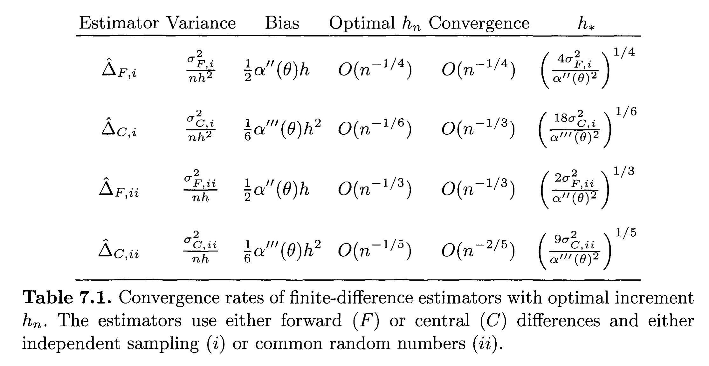

# Wstęp

Projekt jest ćwiczeniem z wyceny opcji metodą Monte Carlo. Prezentujemy metodę różnic skończonych dla wyznaczania pochodnych cząstkowych funkcji ceny opcji, opisaną w [1], w rozdziale 7.1 pt. "Finite-Difference Approximations".

Załóżmy, że mamy estymator $Y$ ceny opcji. Oprócz zależności zmiennej losowej $Y$ od $\omega\in\Omega$, mamy również zależność od parametrów występujących w modelu, np. od ceny startowej $S_0$ (która może być wektorem, jeśli opcja zależy od kilku aktywów), zmienności rynku $\sigma$, stopy procentowej $r$, terminu $T$.

Problem zabezpieczenia opcji, czyli wyboru strategii inwestycyjnej przez wystawcę opcji, tak by zabezpieczyć jej wypłatę, wymaga znalezienia pochodnej ceny opcji $EY$ względem parametru $S_0$.

W ogólności, jesteśmy zainteresowani wyznaczeniem pochodnej funkcji $\theta\mapsto EY(\theta)$ względem pewnego parametru $\theta$ .

Klasyczną metodą aproksymacji pochodnych jest konstruowanie ilorazów różnicowych. Metoda ta nazywana jest metodą różnic skończonych (ang. *finite difference*).

```{r}
# Parametry wspólne:
S_0 = 100
K = 100
r = .05
sigma = .30
T = 1
h = 0.01
n = 100 # ilość trajektorii/prób ceny opcji (nazewnictwo zgodne z [1])
```

```{r}
#
# Na początek, funkcje liczące wartości ceny dla różnych odchylonych parametrów (S_0, sigma, ...):
#
# Przy wyznaczaniu 'delty', użyć poniższej funkcji jako parametru node_value:
node_value_S_0 = function(difference, n, Y_sample = Y_sample_European_call) {
  return ( barYn_estimator(n, S_0 = S_0 + difference, Y_sample) )
}
# Przy wyznaczaniu 'vegi', użyć poniższej funkcji jako parametru node_value:
node_value_sigma = function(difference, n, Y_sample = Y_sample_European_call) {
  return ( barYn_estimator(n, sigma = sigma + difference, Y_sample) )
}
#
# Dwie funkcje, których wersje dla innych opcji (np. europejskich opcji sprzedaży)
# można łatwo napisać i użyć poniżej:
#
payoff_EC = function(S_T) {
  return ( max(0, S_T - K)  )
}
Y_sample_European_call = function(S_0, sigma) {
  Z = rnorm(1)
  S_T = S_0 * exp((r-sigma^2/2)*T + sigma*sqrt(T)*Z)
  return (exp(-r*T) * payoff_EC(S_T))
}
#
# Główne funkcje naszej implementacji, z wymienną funkcją (próbki ceny opcji) Y_sample:
#
barYn_estimator = function(n, S_0 = 100, sigma = .3, Y_sample = Y_sample_European_call) {
  Y = replicate(n, Y_sample(S_0 = S_0, sigma = sigma))
  barYn = mean(Y)
  return (barYn)
}
# Funkcja aproksymująca pochodną estymatora Y, rzędu 1; metodą różnicy prawostronnej;
# parametr node_value jest funkcją i pozwala różniczkować po różnych zmiennych (S_0, sigma, ...).
#
forward_difference = function(h, n, Y_sample = Y_sample_European_call, node_value = node_value_S_0) {
  # Patrz wzór (7.1) w [1], na str. 378:
  Y0 = barYn_estimator(n, S_0 = S_0,     Y_sample)
  Y1 = barYn_estimator(n, S_0 = S_0 + h, Y_sample)
  finite_difference = 1/h * (Y1 - Y0)
  return ( finite_difference )
} 
# Funkcja aproksymująca pochodną estymatora Y, rzędu 1; metodą różnicy centralnej;
# parametr node_value jest funkcją i pozwala różniczkować po różnych zmiennych (S_0, sigma, ...).
#
central_difference = function(h, n, Y_sample = Y_sample_European_call, node_value = node_value_S_0) {
  # Patrz wzór (7.4) w [1], na str. 379:
  
}
```

Ponieważ jednocześnie będziemy brać $n\to\infty$ oraz $h\to 0^+$, więc spróbujmy dobrać ciąg

$$
h_n = h_* n^{-\gamma},
$$

w taki sposób, by błąd średnio-kwadratowy estymatora $\hat\Delta(h_n,n)$ pochodnej był jak najmniejszy. Analiza tego problemu, przeprowadzona w [1], w rozdziale 7.1.2 pt. ,,Optimal Mean Square Error'', podsumowana jest w tabeli 7.1 zawierającej wzory na optymalne wartości współczynników $h_*$ oraz $\gamma$ dla czterech przypadków: $F_{(i)}$, $C_{(i)}$, $F_{(ii)}$, $C_{(ii)}$. Tutaj $F$ oznacza ilorazy różnicowe prawostronne $(Y(\theta+h)-Y(\theta))/h$, zaś $C$ - ilorazy różnicowe centralne $(Y(\theta+h)-Y(\theta-h))/2h$; natomiast $(i)$ oraz $(ii)$ odnoszą się do numerów przypadków we wzorze (7.8) na wariancję różnicy:

$$
\mathop{\mathrm{Var}} [Y(\theta+h)-Y(\theta)] = \begin{cases}
O(1), & \text{w przypadku}\; (i),\\
O(h), & \text{w przypadku}\; (ii),\\
O(h^2), & \text{w przypadku}\; (iii);
\end{cases}
$$

przy czym przypadki te są następujące. Przypadek $(i)$ zachodzi, gdy estymatory $Y(\theta+h)$ oraz $Y(\theta)$ są niezależne. Przypadek $(ii)$ otrzymujemy zazwyczaj, gdy $Y(\theta+h)$ oraz $Y(\theta)$ generujemy przy użyciu tych samych ciągów liczb losowych, np. tego samego ciągu próbek z rozkładu $N(0,1)$: $Z_1$, $Z_2$, ... . W praktyce, taki sam ciąg próbek dla $\theta$ i dla $\theta+h$ uzyskuje się przez ustawienie wartości ziarna generatora liczb losowych. Przypadek $(iii)$ wymaga, by własność ciągłości $Y$ względem $\theta$ zachodziła dla prawie wszystkich funkcji losowych $Y_\omega : \theta \mapsto Y_\omega(\theta)$; nie zajmujemy się nim w tym projekcie.

```{r}
#
# Funkcje pomocnicze do znalezienia wartości optymalnej h_* 
# (patrz [1], wz. (7.10) na str. 381 oraz pierwszy wzór na str. 383). 
# Wymagają one obliczeń wstępnych, dla wybranych i ustalonych h,n 
# (zanim jeszcze będziemy brać coraz większe n-->oo, i coraz mniejsze h-->0+).
#
#
# Uniwersalna funkcja, wstępnie aproksymująca pochodną estymatora Y, rzędu od 1 do 3;
# parametr node_value jest funkcją i pozwala różniczkować po różnych zmiennych (S_0, sigma, ...).
#
alpha_central_differences = function(h, n, Y_sample = Y_sample_European_call, node_value = node_value_S_0) {
  # Ilorazy różnicowe centralne, o dokładności rzędu h^2, patrz [3].
  Y_2 = node_value(-2*h, n)
  Y_1 = node_value(-1*h, n)
  Y0  = node_value(0,    n)
  Y1  = node_value(+1*h, n)
  Y2  = node_value(+2*h, n)
  d1 = (Y2 - Y_2) / (2*h)
  d2 = (Y_1 - 2*Y0 + Y1) / (h^2)
  d3 = (-Y_2/2 + Y_1 - Y1 + Y2/2) / h^3
  return ( c(d1,d2,d3) )
}
h_star_F_i = function(h, n, Y_sample = Y_sample_European_call, node_value = node_value_S_0) {
  # Patrz pierwszy wiersz tabeli 7.1 w [1], ostatnia kolumna:
  Y_theta = replicate(n, Y_sample)
  sigma2 = 2 * var(Y_theta) # p. wzór w [1] na str. 383, wiersz 6 od góry
  # Przybliżona wartość alpha''(theta):
  d_alpha = alpha_central_differences(h, n, Y_sample = Y_sample, node_value = node_value)
  alpha_bis = d_alpha[2]
  fraction = 4 * sigma2 / alpha_bis^2
  h_star = fraction ^ (1/4)
  return (h_star)
}
h_star_C_i = function(h, n, Y_sample = Y_sample_European_call, node_value = node_value_S_0) {
  # Patrz drugi wiersz tabeli 7.1 w [1], ostatnia kolumna:
  Y_theta = replicate(n, Y_sample)
  sigma2 = var(Y_theta)/2 # p. wzór w [1] na str. 383, wiersz 8 od góry
  # Przybliżona wartość alpha'''(theta):
  d_alpha = alpha_central_differences(h, n, Y_sample = Y_sample, node_value = node_value)
  alpha_ter = d_alpha[3]
  fraction = 18 * sigma2 / alpha_ter^2
  h_star = fraction ^ (1/6)
  return (h_star)
}
h_star_F_ii = function(h, n, Y_sample = Y_sample_European_call, node_value = node_value_S_0) {
  # Patrz trzeci wiersz tabeli 7.1 w [1], ostatnia kolumna:

  
  # Uwaga: wymagana we wzorze, nieznana wartość współczynnika wariancji $\sigma^2_{F,ii}$ 
  # może być aproksymowana wstępnie, przy użyciu wzoru w drugiej kolumnie tabeli 7.1.
  
}
h_star_C_ii = function(h, n, Y_sample = Y_sample_European_call, node_value = node_value_S_0) {
  # Patrz czwarty wiersz tabeli 7.1 w [1], ostatnia kolumna:

  
  
  # Uwaga: wymagana we wzorze, nieznana wartość współczynnika wariancji $\sigma^2_{C,ii}$ 
  # może być aproksymowana wstępnie, przy użyciu wzoru w drugiej kolumnie tabeli 7.1.

  }
```

# Porównanie wyników z literaturą

Efektywność naszej implementacji różnic skończonych porównujemy z tabelą 7.1 zamieszczoną w [1] na str. 382:



Tempo zbieżności możemy zbadać łatwo, gdy mamy rozwiązanie dokładne, np. dla zwykłych opcji europejskich (tu dla opcji kupna, bez dywidend, patrz [2]):

$$
\Delta      = \frac{\partial V}{\partial S_0} = \Phi (d_+)
\quad\text{(,,delta'')},
\\
\mathcal{V} = \frac{\partial V}{\partial \sigma} = S_0\Phi (d_+)\sqrt T 
\quad\text{(,,vega'')},
\\
\text{gdzie}\quad d_+ = \frac{\log(S_0/K)+rT}{\sigma\sqrt{T}}+\tfrac12\sigma \sqrt T.
$$ Dla powyższych dwu pochodnych (delta i vega), zbadajmy wykładnik w tempie zbieżności $(E(X_{h,n}^2))^{1/2}$, gdzie $X_{h,n}$ jest błędem estymacji, czyli

$$
X_{h,n} = \frac{\partial V}{\partial \theta} - \hat\Delta(h,n),
\qquad
\text{przy czym}\quad
\hat\Delta(h,n) - \text{estymator pochodnej}.
$$

W tym celu będziemy musieli wykonać replikację wartości $\hat\Delta(h,n)$.

```{r}

```

# Literatura:

[1] Paul Glasserman, Monte Carlo Methods in Financial Engineering, Springer 2003

[2] Wzory jawne dla współczynników greckich w opcjach europejskich. [https://en.wikipedia.org/wiki/Greeks\_(finance)#Formulas_for_European_option_Greeks](https://en.wikipedia.org/wiki/Greeks_(finance)#Formulas_for_European_option_Greeks){.uri}

[3] Ilorazy róznicowe centralne, tabela współczynników. <https://en.wikipedia.org/wiki/Finite_difference_coefficient#Central_finite_difference>
